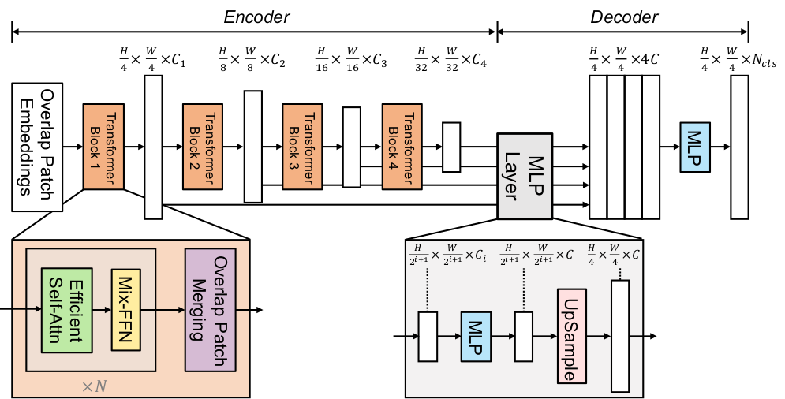

# Semantic-Segmentation-with-Transformer

[](https://huggingface.co/docs/transformers/model_doc/segformer)
[](https://arxiv.org/abs/2105.15203)
## Introduction

A repository of SegFormer model test

## Architecture

<p align="center">

</p>

## Experimentals Results

<p align="center">

</p>

## Installation

Assuming a fresh Anaconda distribution with Python 3.8, you can install the dependencies with:

```sh
cd Semantic-Segmentation-with-Transformer
pip install -r requirements.txt
```

## Training

```sh
python semantic_segmentation_main.py --api train
```

## Evaluate

```sh
python semantic_segmentation_main.py --api eval
```

## Inference

```sh
python semantic_segmentation_main.py --api infer
```

## References

+ https://github.com/NielsRogge/Transformers-Tutorials/blob/master/SegFormer/Fine_tune_SegFormer_on_custom_dataset.ipynb